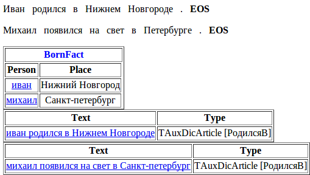

# Example of how the parser works

To examine this, we will use an example where we collect information about who was born in which city. We will look at all the stages of text analysis in order. To begin, we describe the fact fields. You can imagine a fact as a table entry, and its fields as the columns. In this case, we need two columns: one for the person's name (we'll call it Person), and the other for the birthplace (we'll call it Place). We'll call the fact BornFact.

**facttypes.proto file**

```no-highlight
import "base.proto";
import "facttypes_base.proto";
message BornFact: NFactType.TFact 
{
    required string Person = 1;
    required string Place = 2;
}
```

Let's take two simple sentences that have the information we need: `Ivan was born in Nizhny Novgorod` and `Mikhail was born in Petersburg` and write a grammar that can describe sentences of this type:

**bornin.cxx file**

```no-highlight
#encoding "utf-8"
Born -> Verb<kwtype=born>;
City -> Noun<kwtype=city>;
Person -> AnyWord<gram="name">;
S -> Person interp(BornFact.Person) Born "in" City interp(BornFact.Place);
```

The rule `Born -> Verb<kwtype=born>` describes possible predicates that may indicate birth and refers to the gazetteer kw type `born`. Similarly, the rule `City -> Noun<kwtype=city>` describes possible city names and refers to the kw type `city`. The rule `Person -> AnyWord<gram="name">` is triggered on words that have the grammeme `name`. The last rule assembles the full chain with the preposition `in`. The root gazetteer dictionary will look like this:

**dic.gzt file**

```no-highlight
encoding "utf8";
import "base.proto";     
import "articles_base.proto";
import "kwtypes_my.proto";
import "facttypes.proto";
TAuxDicArticle "BornIn"
{
    key = { "tomita:bornin.cxx" type=CUSTOM }
}
city "Nizhny_Novgorod"
{
    key = "Nizhny Novgorod";
    mainword = 2;
}
city "Saint Petersburg"
{
    key = "Saint Petersburg" | "Piter" | "Petersburg";
    lemma = "Saint Petersburg";
} 
born "to_be_born"
{
    key = "to be born"
}
born "come_into_the_world"
{
    key = "come into the world"
}
```

The article `BornIn` refers to the grammar located in the file `bornin.cxx`. Articles of the types `city` and `born` list words and phrases of the appropriate types so that they can be referenced in the grammar using the `kwtype=...` constraint. The `mainword = 2` property indicates that in the phrase `Nizhniy Novgorod` the main word is `Novgorod`, and not the first word, as it would be by default. This is important, since grammatical attributes of the main word are assigned to the entire phrase. Saint Petersburg can be written in several different ways. To account for this, three variations are listed in the `key` field. In order for all the entries about Saint Petersburg to look the same in the BornFact.Place field, we added the field `lemma=`, which points to the name variation that should be used during normalization.

The kw types `city` and `born` are declared in the `kwtypes_my.proto` file. All the kw types used must be described this way. Some of them are already described in the built-in file `kwtypes_base.proto`.

**kwtypes_my.proto file**

```no-highlight
import "base.proto";     
import "articles_base.proto";
message born : TAuxDicArticle {}
message city : TAuxDicArticle {}
```

The configuration file for launching the parser looks like this:

**config.proto file**

```no-highlight
encoding "utf8";
TTextMinerConfig {
  Dictionary = "dic.gzt";       // root gazetteer dictionary
  PrettyOutput = "debug.html";  // file with debugging output
  Input = {
    File = "test.txt";          // file with analyzed text
    Type = dpl;                 // "document per line" reading mode (each line is a separate document)
  }
  Articles = [
    { Name = "BornIn" }       // Run the root dictionary entry "BornIn"
  ]
  Facts = [
    { Name = "BornFact" }       // Save the fact "BornFact"
  ]
  Output = {
    File = "facts.txt";         // Write facts to the "facts.txt" file
    Format = text;              // using plain text format
  }
}
```

**test.txt file**

```no-highlight
Ivan was born in Nizhny Novgorod.
Mikhail came into the world in Petersburg.
```

To launch the parser, set an argument for the `tomitaparser.exe` program with the name of the configuration file `config.proto`:

`tomitaparser.exe config.proto`

When the parser has finished running, it prints a message about successful compilation of the root dictionary and grammars, and also of the start and finish times for processing the text:

```no-highlight
Compiling "dic.gzt" ... OK
  Compiling bornin.cxx ...  (10 unique symbols, 5 rules) OK
[25:10:12 13:35:05] - Start.  (Processing files.)
[25:10:12 13:35:05] - End.  (Processing files.)
```

As a result of processing, two files will be generated: `facts.txt` and `debug.html`. The first file (`facts.txt`) contains processed text and facts extracted from it. Plain text format is convenient for checking how facts were extracted during development, but it is not intended for further automated processing. For automated processing, use `Format=xml`. The second file (`debug.html`) contains more detailed debugging information, including morphological analysis (displayed when the mouse pointer hovers over a word) and chains of words that correspond to root dictionary entries.

**facts.txt file**

```no-highlight
Ivan was born in Nizhny Novgorod . 
 BornFact
 {
  Person = ivan
  Place = Nizhny Novgorod
 }
Mikhail came into the world in Petersburg . 
 BornFact
 {
  Person = mikhail
  Place = Saint Petersburg
 }
```

**debug.html file**



Now we'll look in detail at how the parser works on these two sentences. In the tables below, the stages of text analysis are shown in order, starting with morphological analysis, which results in lemmas and grammatical attributes. Next, keys from the gazetteer articles mentioned in the grammar are searched for. In the first sentence, these are the keys <q>to be born</q> (`kwtype="born"`) and <q>Nizhny Novgorod</q> (`kwtype="city"`). Since `kwtype="city"` is used in the grammar, the chain <q>Nizhny Novgorod</q> will be input to it as a multiword that triggers the terminal `Noun<kwtype="city">`. In the same way, the terminal `Verb<kwtype="born">` is triggered on the chain <q>came into the world</q>. Using the terminals listed in the <q>terminals</q> string, the GLR parser assembles the nonterminals `Person`, `Born`, and `City` using the rules described in the `bornin.cxx` file. In the rule `S -> Person interp(BornFact.Person) Born "in" City interp(BornFact.Place)`, an interpretation is run that normalizes and interprets (writes) chains matching the nonterminals `Person` and `City` to the fields `BornFact.Person` and `BornFact.Place` for the fact `BornFact`.

text | lemmas | grammatical attributes | kw-type | terminals | nonterminals | interpretation (fact field)
----- | ----- | ----- | ----- | ----- | ----- | -----
_Ivan_ | ivan | S, persn, nom, sg, m, anim | &nbsp; | `AnyWord<gram="persn">` | `Person` | `BornFact.Person` 
_was born_ | to be born | V, praet, sg, indic, m, pf, intr | `born` | `Verb<kwtype="born">` | `Born` | &nbsp;
_in_ | in | PR | &nbsp; | `"in"` | `"in"` | &nbsp;
_Nizhny_ | nizhny | A, abl, sg, plen, m, n | `city` | `Noun<kwtype="city">` | `City` | `BornFact.Place`
_Novgorod_ | novgorod | S, geo, abl, sg, m, inan |  `city` | `Noun<kwtype="city">` | `City` | `BornFact.Place`

text | lemmas | grammatical attributes | kw-type | terminals | nonterminals | interpretation (fact field)
----- | ----- | ----- | ----- | ----- | ----- | -----
_Mikhail_ | Mikhail | S, persn, nom, sg, m, anim | &nbsp; | `AnyWord<gram="persn">` | `Person` | `BornFact.Person` 
_came_ | come | V, praet, sg, indic, m, pf, intr | `born` | `Verb<kwtype="born">` | `Born` | &nbsp;
_into_ | into | PR | &nbsp; | &nbsp; | &nbsp; | &nbsp;
_the world_ | the world | S, nom, acc, sg, m, inan | &nbsp; | &nbsp; | &nbsp; | &nbsp;
_in_ | in | PR | &nbsp; | `"in"` | `"in"` | &nbsp;
_Petersburg_ | Saint Petersburg | S, geo, abl, sg, m, inan |  `city` | `Noun<kwtype="city">` | `City` | `BornFact.Place`

