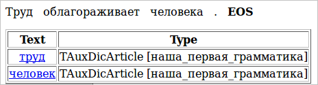
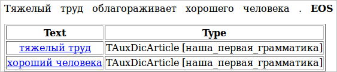

# Basic rules

Tomita grammars work with chains. A single chain corresponds to a single sentence in a text. Subchains are extracted from the chain, and then the subchains are interpreted into facts that are divided into fields.

The grammar rules that extract subchains look like this:

`S -> Noun;`

This rule extracts all nouns from the chain. For example, for text **(1)** it extracts the subchains _work_ and _man_.

> **(1)**_Work enobles a man_

Note that chains are automatically normalized (lemmatized) when they are extracted.

In this rule, `Noun` is a terminal. A terminal can only be on the right side of a rule. In Tomita, terminals include the names of parts of speech (`Noun`, `Verb`, `Adj`) and certain symbols (`Comma`, `Punct`, `Ampersand`, `PlusSign`), as well as lemmas (`‘forest’`, `‘run’`); see the [list of terminals](../dg/terminals-list.md).

`S` is a nonterminal that is built from terminals and must occur at least once on the left side of the rule. If a nonterminal only occurs on the left side and never occurs on the right side, this means it is the grammar root. It can also be declared:

```no-highlight
#GRAMMAR_ROOT S    // Using the #GRAMMAR_ROOT directive, the nonterminal S is declared as the root (head) of the grammar
S -> Noun;
```

The grammar's encoding may also be specified at the beginning:

```no-highlight
#encoding "utf-8"    // Tells the parser which encoding the grammar is written in
#GRAMMAR_ROOT S      // Sets the grammar's root nonterminal
S -> Noun;           // Rule for extracting a chain consisting of a single noun
```

To run the grammar, we need to create the root dictionary. Each new grammar that we create must be added to it as a separate entry. Create the file first.cxx, where we will write our first grammar. For now it will only have the three lines that are shown above.

Next, create the root dictionary file, mydic.gzt, and enter the following in it:

```no-highlight
encoding "utf8";               // Specifies the encoding used for this file
import "base.proto";           // Enables protobuf type descriptions (TAuxDicArticle and others)
import "articles_base.proto";  // The files base.proto and articles_base.proto are built into the compiler.
                               // They must be enabled at the beginning of any gzt dictionary.
// Entry with our grammar:
TAuxDicArticle "our_first_grammar"
{
    key = { "tomita:first.cxx" type=CUSTOM }
}
```

Files with the `.gzt` extension will be discussed in more detail later.

Now we need to create the parameters file, where we will define the path to the root dictionary, the path to the input and output files, and other information that is necessary for running the grammar. Create the `config.proto` file and enter the following in it:

```no-highlight
encoding "utf8"; // Sets the encoding the configuration file is written in
TTextMinerConfig {
  Dictionary = "mydic.gzt"; // Path to the root dictionary
  PrettyOutput = "PrettyOutput.html"; // Path to the file with readable debugging output
  Input = {
    File = "test.txt"; // Path to the input file
  }
  Articles = [
    { Name = "our_first_grammar" } // Name of the entry in the root dictionary
                                          // that contains the grammar being run
  ]
}
```

Now we just need to create the `test` file and write the sentence in it that we want to parse using our grammar:

_Work enobles a man._

To run the grammar, we will need the tomitaparser program, which will have the `config.proto` file as its parameter. So we need to write the following command in the command line:

```no-highlight
For Linux, FreeBSD and other *nix systems:
./tomitaparser config.proto
For Windows:
tomitaparser.exe config.proto
```

On the screen, you will see a message with the date and time when the parser started and finished. After it has finished, it prints an empty XML file which would contain facts if the grammar had extracted them (facts are explained in more detail in the following sections of the tutorial).

```no-highlight
[15:10:12 18:20:01] - Start.  (Processing files.)
[15:10:12 18:20:01] - End.  (Processing files.)
<?xml version='1.0' encoding='utf-8'?><fdo_objects></fdo_objects>
```

After this, you can open the `PrettyOutput.html` file and see which chains were extracted by our grammar. For our example, `PrettyOutput.html` will look like this:



In order to extract not only separate nouns from the text, but nominal groups as well, the concatenation operation is used. A normal space serves as the concatenation operator:

`S -> Adj Noun;`

> **(2)** Hard work enobles a man.

> **(3)**_Hard work enobles a good man._

Now we can take text **(2)** and extract the chain _hard work_. Note that "man" was ignored in this instance: the presence of an adjective before the noun is a required condition for extracting the chain. We can fix this by changing the original sentence **(3)**. Now we have two chains for output: _hard work_ and _good man_.



And if we are not interested in which kind of work there is, but only in which kind of people there are, we can write this grammar:

`S -> Adj ‘man’;`

## Source files for the tutorial1 project

* `tutorial1/config.proto` — parser configuration file.
* `tutorial1/mydic.gzt` — root dictionary.
* `tutorial1/first.cxx` — grammar.
* `tutorial1/test.txt` — text.


