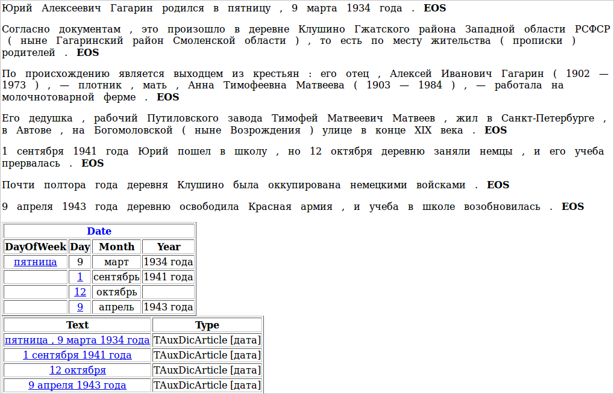

# Interpretation

In the beginning we mentioned that Tomita extracts subchains and interprets them as facts divided into fields. So far we have only learned how to extract subchains, and now we will try to map their facts.

Let's say we have a biography and we want to extract all the dates from it. Instead of extracting them as whole chains, further processing will be easier if we immediately separate them into fields: day of the week, date, month, and year. To do this, we need to create the "Date" fact with a list of fields. We'll create a separate file for describing the facts: facttypes.proto. We need to import it to the root dictionary, so we add this line to the file mydic.gzt:

`import "facttypes.proto";`

In the facttypes.proto file, we enter the following:

```no-highlight
import "base.proto";           // description of protobuf types
import "facttypes_base.proto"; // description of the NFactType.TFact protobuf type
message Date: NFactType.TFact 
{
    optional string DayOfWeek = 1;
    optional string Day = 2;
    optional string Month = 3;
    optional string Year = 4;
}
```

In the line `message Date: NFactType.TFact`, `Date` is the name of the fact type that we are defining. The `Date` fact type is inherited from the `NFactType.TFact` base type, which all fact types must be inherited from. Next, the fields for the `Date` fact are defined in curly brackets. First we specify whether the field must be filled in (`optional` - may be empty; `required` - must contain a value, or the fact will not be formed). Then the field type is set to `string` - this is the most common type. Any text strings can be put in a `string` type field.

`DayOfWeek` — Field name. All fields are numbered in order, starting from one.

We will also need a list of days of the week and months — we need to create the corresponding gazetteer entries for this. To avoid creating a separate file, we can add them directly in the root dictionary:

```no-highlight
TAuxDicArticle "month"
{
    key = "January" | "February" | "March" | "April" | "May" | "June" |
          "July" | "August" |   "September" | "October" | "November" | "December"
}
TAuxDicArticle "week_day"
{
    key = "Monday" | "Tuesday" | "Wednesday" | "Thursday" | "Friday" | "Saturday" | "Sunday"
}
```

Now we'll write the grammar that will extract dates from the text and interpret them into facts. We'll call it date.cxx.

```no-highlight
#encoding "utf-8"
DayOfWeek -> Noun<kwtype="week_day">;      // using the words from the "week_day" entry
Day -> AnyWord<wff=/([1-2]?[0-9])|(3[0-1])/>; // a number from 1 to 31
Month -> Noun<kwtype="month">;                // using the words from the "month" entry
YearDescr -> "год" | "г. ";
Year -> AnyWord<wff=/[1-2]?[0-9]{1,3}г?\.?/>; // число от 0 до 2999 с возможным "г" или "г." в конце
Year -> Year YearDescr;
        // day of the week, comma, date, month and year:
        // "Monday, 3 September 2012"
Date -> DayOfWeek interp (Date.DayOfWeek) (Comma)
        Day interp (Date.Day) 
        Month interp (Date.Month)
        (Year interp (Date.Year)); 
        // date, month and year: "10 January 2011"
Date -> Day interp (Date.Day)
        Month interp (Date.Month)
        (Year interp (Date.Year));
        // month and year: "June 2009"
Date -> Month interp (Date.Month)
        Year interp (Date.Year);
```

To interpret the desired substring into a fact, we need to write the word "interp" and follow it with parentheses containing the fact name and the name of the field inside this fact that the substring should go in.

To run this grammar, first we need to add a new entry to the root dictionary:

```no-highlight
TAuxDicArticle "date"
{
    key = { "tomita:date.cxx" type=CUSTOM }
}
```

Secondly, we need to add information to the config.proto file containing the run options about which facts we are going to use in grammars we are running:

```no-highlight
Facts = [
    { Name = "Date" }
]
```

We can also add the output file to write the facts to (if we don't do this, they will be printed right on the screen):

```no-highlight
Output = {
    File = "facts.txt";
    Format = text;        // the following formats can be used:
                          // proto (Google Protobuf), xml, text
}
```

The facts will be saved to the facts.txt file (for further processing), and will also be in PrettyOutput.html in a readable format. For example, if we input a section of Gagarin's biography to the grammar:

> **(12)** Yuriy Alexeevich Gagarin was born on Friday, 9 March 1934. According to the documents, this occurred in the village of Klushino in the Gzhatskiy district of the Western region of Soviet Russia (now called the Gagarinskiy district of the Smolensk region), where his parents were registered as residents. He is descended from peasants: his father, Alexey Ivanovich Gagarin (1902—1973) was a carpenter, and his mother, Anna Timofeevna Matveeva (1903—1984) worked on a dairy farm. His grandfather Timofey Matveevich Matveev was a worker at the Putilov factory and lived in Saint Petersburg on Bogomolovskiy street (now Vozrozhdeniya street) in the Avtovo area at the end of the 19th centruy. On September 1st, 1941 Yuriy started school, but on October 12th the village was occupied by the Germans and his studies were interrupted. The village of Klushino was occupied by German troops for almost a year and a half. On April 9th 1943, the village was freed by the Red Army, and school studies resumed.

This is what we will see in PrettyOutput.html:




## Source files for the tutorial4 project <a name="isxodnyefajjlyproektatutorial4"></a>

* `tutorial4/config.proto` — parser configuration file.
* `tutorial4/facttypes.proto` — fact type descriptions.
* `tutorial4/mydic.gzt` — root dictionary.
* `tutorial4/date.cxx` — grammar for dates.
* `tutorial4/test.txt` — the text <q>Yuriy Alexeevich Gagarin was born on Friday...</q>.


