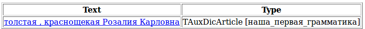

# Constraint fields

What kinds of women are there? To answer this rather complex question, we must add a little morphological information to our rules. In particular, we need to specify that we are not interested in all proper names, but only in female names. Tomita uses constraint fields to do this. In contrast to constraint tags (`h-reg1`, `fw`, `rt` and so on), fields can have various values that are set as `field_name = 'value'`. For our case, we need the `gram` field with the value set to "female".

The grammar that has been slightly modified to extract information about women will look like this:

```no-highlight
#encoding "utf-8"
ProperName ->  Word<h-reg1, gram='f'>+; 
Person -> ProperName | 'woman'; 
FormOfAddress -> 'comrade' | 'Miss' | 'Mrs.' | 'Ms.';
AdjCoord -> Adj;
AdjCoord -> AdjCoord<gnc-agr[1]> ',' Adj<gnc-agr[1]>;
AdjCoord -> AdjCoord<gnc-agr[1]> 'and' Adj<gnc-agr[1]>; 
S -> Adj<gnc-agr[1]>+ (FormOfAddress) Person<gnc-agr[1], rt>; 
S -> AdjCoord<gnc-agr[1]> (FormOfAddress) Person<gnc-agr[1], rt>;
```

This grammar will only work on the last one from examples **(6)**-**(8)**.



The value of the `gram` field may be any grammeme that is assigned to this word in the morphologic dictionary. For example, to increase the accuracy of extracting person names, we can specify that they must consist of surname, first name, and patronymic, and not just capitalized words in a row:

```no-highlight
ProperName -> (Word<h-reg1, gram=”famn, f”>)
              Word<h-reg1, gram=”persn, f”>
              (Word<h-reg1, gram=”patrn, f”>);
```

