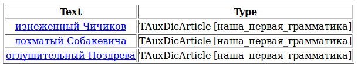

# Constraint tags

All people have names. This means that in order to expand our knowledge of what kind of people there are, we need to extract not only the adjectives that precede the work "man", but also adjectives that define proper names.

A distinct characteristic of proper names is that they are written with a capital letter. To give this information to Tomita, we need to apply the appropriate restrictions in the rule to a terminal or nonterminal indicating a person.

To apply a restriction to a terminal or nonterminal, Tomita uses special tags (see the [list of tags](../../dg/concept/all-labels-list.md)). In our case, we need the `h-reg1` tag, which specifies that the first letter in the word must be capitalized. If the first letter is lowercase, a rule with this tag will not be triggered. So we get the following rule:

`S -> Adj Word<h-reg1>;`

In addition to the `h-reg1` tag, there are also the `h-reg2` tag, which indicates that all the letters in the word must be uppercase (like in the word `MOSCOW`), and the `h-reg3` tag indicating [CamelCase](http://ru.wikipedia.org/wiki/CamelCase), in which the first letter and at least one other letter in the word are uppercase (like in the word `CityInvest`).

By processing the following text using the rule `S -> Adj Word<h-reg1>`, we find out exactly which epithets are used for describing the literary characters in it.

> **(4)** In a crimson tailcoat and snow-white knickers, the effeminate Chichikov travels across the Russian open and comes across not people, but... porcelain dolls: either the Manilov pair (rosy cheeks and rosy frills), or the dissheveled Sobakevich with his wife, or the deafening Nozdrev in a hussar jacket on a bare chest. (Gogol N. V. , <q>Dead Souls</q>)

In this example, the rules worked on the correct words, but the normalization results are unlikely to satisfy us, since only the adjectives are lemmatized. Since we didn't say anything about the relationship between `Adj` and `Word<h-reg1>` other than that they are next to each other and in exactly this order, the parser does not know that the adjective changes with the noun ("dissheveled Sobakevich" in Russian is `lohmatiy Sobakevich` - nominative case, `lohmatovo Sobakevicha` - accusative case, `lohmatomu Sobakevichu` - dative case, and so on). By default, only the main word in the chain is lemmatized. If a different one is not specified, the main word is the first one in the chain. For information on how to tell the parser about relationships between words and how to specify the main word in a chain, please read the following sections of this tutorial.

