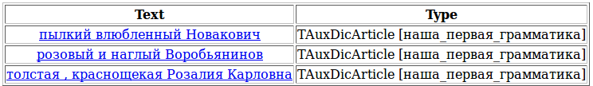

# Main word

Every rule-based chain has a main word. The grammatical characteristics of the main word are inherited by the entire chain as a multiword unit. By default, the first word in the chain is the main word. In the grammar for the previous example, the main words of the chains extracted by the `AdjCoord` and `S` rules will be adjectives, so the resulting chains will also be considered adjectives. This will be correct for `AdjCoord` but not for `S`, because we may want to add these chains to other rules later, and we will need them to function as nouns and inherit the grammemes of the `Person` nonterminal. In order to show the parser which word is the main word, we use the `rt` tag.

The `rt` tag also influences the normalization of words that are in agreements. During normalization, grammemes are inherited from the main word to the dependent word, and not the other way around. You can see this clearly when the agreement is between an adjective and a neuter noun:  ("the French embassy") or  ("delicious meringue"); both examples have a singular neuter nominative adjective followed by a singular neuter nominative noun. The lemmatized adjective form is masculine singular nominative case. So after normalizing the chains extracted by the rules `S -> Adj<gnc-agr[1]> Noun<gnc-agr[1]>;`, we get  and <q>`vkusniy beze`; both now have a masculine nominative adjective followed by a neuter nominative noun.</q> To make the adjectives take the neuter form during normalization, we need to specify that the main word is the noun, and that this is the word that determines which form to use for an adjective that is in agreement with it: `S -> Adj<gnc-agr[1]> Noun<gnc-agr[1], rt>;`.

Returning to the grammar from the previous example, its final version should look like this:

```
#encoding "utf-8"
ProperName ->  Word<h-reg1>+; 
Person -> ProperName | ‘person’;
FormOfAddress -> ‘comrade’ | ‘Mr.’ | ‘Sir’; 
AdjCoord -> Adj;
AdjCoord -> AdjCoord<gnc-agr[1]> ',' Adj<gnc-agr[1]>;
AdjCoord -> AdjCoord<gnc-agr[1]> 'and' Adj<gnc-agr[1]>;
S -> Adj<gnc-agr[1]>+ (FormOfAddress) Person<gnc-agr[1], rt>; 
S -> AdjCoord<gnc-agr[1]> (FormOfAddress) Person<gnc-agr[1], rt>;
```



> [!IMPORTANT]
> 
> The configuration file specifies that the text to analyze is taken from standard input, and not from a file. So we need to pass the contents of the test files to the standard input stream when we run the project.
> 

This means that we can run the project either on a single file or on all three files at once, without changing the `config.proto` file:

```no-highlight
# For Linux, FreeBSD and other *nix systems:
# all files
cat test?.txt | ./tomitaparser config.proto
# one file
cat test1.txt | ./tomitaparser config.proto
rem For Windows:
rem all files
type test?.txt | tomitaparser.exe config.proto
rem one file
tomitaparser.exe config.proto < test1.txt
```

To make the parser read the text from a file, we have to add the following text to the config file before the line :

```no-highlight
Input = {
    File = "test3.txt"; // path to the input file
  }
```

