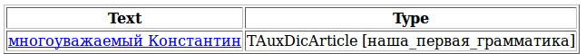
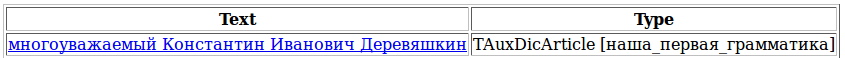
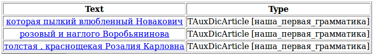

# Operators

Let's take another sentence **(5)** and apply the rule `S -> Adj Word<h-reg1>` that was explained in the [previous section](limits-labels.md).

> **(5)** At first, the distinguished Konstantin Ivanovich Derevyashkin strictly forbid cursing and even stamped his foot, but later, after some hesitation, fascinated by the idea, he ordered to summon a former sailor - a reckless swearer and ruffian - from the house next door.



Our rule does not extract Konstantin's surname and patronymic. For the next step in the grammar, we need to consider that an adjective can have either one, two, or three names after it (i.e. capitalized words). This can be written as three separate rules.

```no-highlight
S -> Adj Word<h-reg1>;                            // "effeminate Chichikov"
S -> Adj Word<h-reg1> Word<h-reg1>;               // "latter-day Al Capone"
S -> Adj Word<h-reg1> Word<h-reg1> Word<h-reg1>;  // "distinguished Konstantin Ivanovich Derevyashkin"
```

Luckily, this grammar can be reduced to a single rule using the "+" operator, which indicates that the terminal or nonterminal can occur in the chain one or more times. As a result, the grammar will look like this:

`S -> Adj Word<h-reg1>+;`



The <q>+</q> sign and other operators are documented in the Developer's Guide in the [Operators](../dg/rules.md) section.

Next, we should consider that there may be more than one adjective, and they can be separated by a comma or a coordinating conjunction, or not separated by anything:

> **(6)** They placed a sizeable bowl with a champagne cup in the center of the large Persian carpet, and the whole crowd stretched out around it in radiuses, not excepting Yablonka, who the ardently amorous Novakovich made a regal bed for: the hide of a polar bear, with a plush rug on top of it, and on top of the rug was Yablonka, resting her round alabaster chin on the enormous furry head of the frightful beast.

> **(7)** But the Prosecutor, still passing by the gun shop as before, rolled up to the building of the judicial institution every morning, sadly looking at the shape of Themis holding the scales, in one cup of which he clearly saw himself as the St. Petersburg Prosecutor, and in the other - the pink and impudent Vorobiayaninov.

> **(8)**The fat, red-cheeked Rosalia Karlovna entered the bedroom and stopped in an expectant pose.

To parse example number 6, we must add the "+" operator to the Adj terminal. To handle examples 7 and 8, we need to write several additional rules:

```no-highlight
AdjCoord -> Adj;                                      // a singular instance, when the chain of homogenous adjective members
                                                      // consists of a single adjective
AdjCoord -> AdjCoord<gnc-agr[1]> ',' Adj<gnc-agr[1]>; // homogenous adjective members can be separated by a comma
AdjCoord -> AdjCoord<gnc-agr[1]> 'and' Adj<gnc-agr[1]>; // or with the coordinating conjunction "and"
```

The `gnc-agr` tag indicates that the words tagged by it must agree in gender, number and case. This will be explained in more detail later in this tutorial and in the Developer's Guide.

Now we must recall that a person can be labeled not only with a proper name, but also specifically using the word "person", and we will add it to the terminal indicating a proper name using the disjunction operator "|".

Finally, between the proper name and the defining adjective we often see a form of address, such as comrade, sir, Mr., and so on. To specify that an element in the chain is optional (it might be there, and might not), it is put in parentheses.

As a result, we get this grammar:

```no-highlight
#encoding "utf-8"
#GRAMMAR_ROOT S
ProperName ->  Word<h-reg1>+;                         // defining a proper name
Person -> ProperName | 'person';                     // a person can be indicated using a proper name
                                                      // or the word "person"
FormOfAddress -> 'comrade' | 'Mr.' | 'sir';   // listing possible forms of address
AdjCoord -> Adj;                                      // singular instance, when the chain of homogenous adjective members
                                                      // consists of a single adjective
AdjCoord -> AdjCoord<gnc-agr[1]> ',' Adj<gnc-agr[1]>; // homogenous adjective members can be separated by a comma
AdjCoord -> AdjCoord<gnc-agr[1]> 'and' Adj<gnc-agr[1]>; // or by the coordinating conjunction "and"
S -> Adj+ (FormOfAddress) Person;                     // for cases when adjectives follow each other
S -> AdjCoord (FormOfAddress) Person;                 // for cases when adjectives are separated by a comma
                                                      // or coordinating conjunction
```

If we apply this grammar to examples 6 through 8, Tomita parser will extract three chains:



We see that an extra word ended up in the first chain – "who". This happened because it is a pronoun adjective, which means it conforms to the rule `S -> Adj+ (FormOfAddress) Person`;

The second chain was extracted correctly, but it was normalized incorrectly. This is because only the main word in the chain is normalized (by default, the first word) along with the words that are connected to it, but our rules did not specifically define the relationship of words to each other.

Both of these problems can be resolved by specifying in the rules that a noun and its defining adjective must agree in gender, number and case.

In the Tomita parser syntax, it is written like this:

`S -> Adj<gnc-agr[1]>+ (FormOfAddress) Person<gnc-agr[1]>;`

`gnc-agr` stands for GenderNumberCase-Agreement, and the square brackets contain the agreement identifier, indicating which elements in the right part of the rule are in agreement.

Note that one rule may use several different agreements with different identifiers. For example, the rule `S -> Participle<gnc-agr[2]> Adj<gnc-agr[1]> Noun<gnc-agr[1], gram=’ins’> Noun<gnc-agr[2], gram=’nom’, rt>;` requires agreement between the first and fourth terminals and between the second and third terminals. This rule would correctly handle the chain  ("beloved drink of the local population"). The first word is a singular masculine nominative adjective describing the fourth word, which is a singular masculine nominative noun. The second word is a singular instrumental adjective describing the third word, which is a singular mascular instrumental noun. The `gram='ins'` and `gram='nom'` tags that are used in this example indicate that the words must be in the specified cases (instrumental and nominative). This tag is described in detail in later sections, as well as in the Developer's guide.

Adding agreement to our grammar:

```no-highlight
#encoding "utf-8"
ProperName ->  Word<h-reg1>+; 
Person -> ProperName | ‘person’;
FormOfAddress -> ‘comrade’ | ‘Mr.’ | ‘Sir’; 
AdjCoord -> Adj;
AdjCoord -> AdjCoord<gnc-agr[1]> ',' Adj<gnc-agr[1]>;
AdjCoord -> AdjCoord<gnc-agr[1]> 'and' Adj<gnc-agr[1]>;
S -> Adj<gnc-agr[1]>+ (FormOfAddress) Person<gnc-agr[1]>; 
S -> AdjCoord<gnc-agr[1]> (FormOfAddress) Person<gnc-agr[1]>;
```


For the first example, this grammar will extract the chain "ardently amorous Novakovich" without the word "who", because "who", which is feminine because it refers to the woman Yablonka, does not agree in gender with the masculine surname "Novakovich". In addition, the entire extracted chain is normalized, not just the main word, because the words are clearly linked to each other by agreement.

