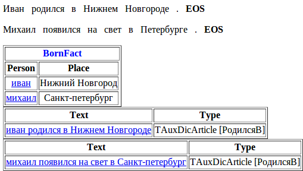

# Пример работы парсера

Рассмотрим это на примере, в котором будем собирать информацию о том, кто в каком городе родился. При этом посмотрим последовательно на все этапы анализа текста. Для начала опишем поля факта. Факт можно представить себе как запись в таблице, а поля - как ее колонки. В данном случае нужны две колонки: одна для имени человека (назовем Person), другая — для места рождения (назовем Place). Сам факт назовем BornFact.

**Файл facttypes.proto**

```no-highlight
import "base.proto";
import "facttypes_base.proto";
message BornFact: NFactType.TFact 
{
    required string Person = 1;
    required string Place = 2;
}
```

Возьмем два простых предложения, в которых есть интересующая нас информация: `Иван родился в Нижнем Новгороде` и `Михаил родился в Петербурге` и напишем грамматику, которая может описать предложения такого типа:

**Файл bornin.cxx**

```no-highlight
#encoding "utf-8"
Born -> Verb<kwtype=born>;
City -> Noun<kwtype=city>;
Person -> AnyWord<gram="имя">;
S -> Person interp(BornFact.Person) Born "в" City interp(BornFact.Place);
```

Правило `Born -> Verb<kwtype=born>` описывает возможные предикаты, которые могут указывать на рождение, и ссылается на kw-type газеттира `born`. Аналогичным образом, правило `City -> Noun<kwtype=city>` описывает возможные названия городов и ссылается на kw-type `city`. Правило `Person -> AnyWord<gram="имя">` сработает на словах, у которых есть граммема `имя`. Последнее правило собирает полную цепочку с предлогом `в`. Корневой словарь газеттира при этом будет выглядеть следующим образом:

**Файл dic.gzt**

```no-highlight
encoding "utf8";
import "base.proto";     
import "articles_base.proto";
import "kwtypes_my.proto";
import "facttypes.proto";
TAuxDicArticle "РодилсяВ"
{
    key = { "tomita:bornin.cxx" type=CUSTOM }
}
city "Нижний_Новгород"
{
    key = "Нижний Новгород";
    mainword = 2;
}
city "Санкт_Петербург"
{
    key = "Санкт-Петербург" | "Питер" | "Петербург";
    lemma = "Санкт-Петербург";
} 
born "родиться"
{
    key = "родиться"
}
born "появиться_на_свет"
{
    key = "появиться на свет"
}
```

Статья `РодилсяВ` ссылается на грамматику, находящуюся в файле `bornin.cxx`. Статьи типа `city` и `born` перечисляют слова и словосочетания соответствующих типов, чтобы на них можно было ссылаться в грамматике при помощи ограничения `kwtype=...`. Свойство `mainword = 2` указывает, что в словосочетании `Нижний Новгород` главным словом является `Новгород`, а не первое слово, как было бы по умолчанию. Это важно, т.к. грамматические признаки главного слова приписываются всему словосочетанию. Санкт-Петербург может быть назван несколькими способами. Чтобы учесть и это, три варианта перечислены в поле `key`. Для того, чтобы в поле BornFact.Place все записи про Санкт-Петербург выглядели одинаково, добавлено поле `lemma=`, указывающее на тот вариант названия, который должен быть использован при нормализации.

kw-типы `city` и `born` объявлены в файле `kwtypes_my.proto`. Все используемые kw-типы должны быть описаны таким образом. Некоторые из них (ссылка?) уже описаны во встроенном файле `kwtypes_base.proto`.

**Файл kwtypes_my.proto**

```no-highlight
import "base.proto";     
import "articles_base.proto";
message born : TAuxDicArticle {}
message city : TAuxDicArticle {}
```

Конфигурационный файл для запуска парсера выглядит следующим образом:

**Файл config.proto**

```no-highlight
encoding "utf8";
TTextMinerConfig {
  Dictionary = "dic.gzt";       // корневой словарь газеттира
  PrettyOutput = "debug.html";  // файл с отладочным выводом
  Input = {
    File = "test.txt";          // файл с анализируемым текстом
    Type = dpl;                 // режим чтения "document per line" (каждая строка - отдельный документ)
  }
  Articles = [
    { Name = "РодилсяВ" }       // Запустить статью корневого словаря "РодилсяВ"
  ]
  Facts = [
    { Name = "BornFact" }       // Сохранить факт "BornFact"
  ]
  Output = {
    File = "facts.txt";         // Записать факты в файл "facts.txt"
    Format = text;              // используя при этом простой текстовый формат
  }
}
```

**Файл test.txt**

```no-highlight
Иван родился в Нижнем Новгороде.
Михаил появился на свет в Петербурге.
```

Для запуска парсера достаточно указать в качестве аргумента программы `tomitaparser.exe` имя конфигурационного файла `config.proto`:

`tomitaparser.exe config.proto`

В результате своей работы парсер напечатает сообщения об успешной компиляции корневого словаря и грамматики, а также о времени начала и завершения обработки текста:

```no-highlight
Compiling "dic.gzt" ... OK
  Compiling bornin.cxx ...  (10 unique symbols, 5 rules) OK
[25:10:12 13:35:05] - Start.  (Processing files.)
[25:10:12 13:35:05] - End.  (Processing files.)
```

В результате обработки будут сгенерированы два файла: `facts.txt` и `debug.html`. Первый файл (`facts.txt`) содержит обработанный текст и выделенные из него факты. Простой текстовый формат удобен для проверки выделения фактов во время разработки и не предназначен для последующей автоматической обработки. Для автоматической обработки используйте формат `Format=xml`. Второй файл (`debug.html`) содержит более подробную отладочную информацию, включая морфологический разбор (отображается при наведении указателя мышки на слово) и цепочки слов, соответствующие статьям корневого словаря.

**Файл facts.txt**

```no-highlight
Иван родился в Нижнем Новгороде . 
 BornFact
 {
  Person = иван
  Place = Нижний Новгород
 }
Михаил появился на свет в Петербурге . 
 BornFact
 {
  Person = михаил
  Place = Санкт-петербург
 }
```

**Файл debug.html**



Далее рассмотрим подробно работу парсера на этих двух предложениях. В приведенных ниже таблицах последовательно показаны этапы анализа текста, начиная с морфологического разбора, результатом которого являются леммы и грамматические признаки. Далее ищутся ключи из упомянутых в грамматике статей газеттира. В первом предложении это ключ <q>родиться</q> (`kwtype="born"`) и ключ <q>Нижний Новгород</q> (`kwtype="city"`). Поскольку `kwtype="city"` используется в грамматике, то цепочка <q>Нижний Новгород</q> попадет к ней на вход в виде мультиворда, на котором сработает терминал `Noun<kwtype="city">`. Аналогичным образом сработает и терминал `Verb<kwtype="born">` на цепочке <q>появился на свет</q>. Из терминалов, перечисленных в строке <q>терминалы</q>, GLR-парсер соберет нетерминалы `Person`, `Born` и `City` по правилам, описаным в файле `bornin.cxx`. В правиле `S -> Person interp(BornFact.Person) Born "в" City interp(BornFact.Place)` выполняется интерпретация, в ходе которой цепочки, сопоставленные нетерминалам `Person` и `City`, нормализуются и интерпретируются (записываются) в поля `BornFact.Person` и `BornFact.Place` факта `BornFact`.

текст | леммы | грамматические признаки | kw-type | терминалы | нетерминалы | интерпретация (поля факта)
----- | ----- | ----- | ----- | ----- | ----- | -----
_Иван_ | иван | S, persn, nom, sg, m, anim | &nbsp; | `AnyWord<gram="persn">` | `Person` | `BornFact.Person` 
_родился_ | родиться | V, praet, sg, indic, m, ipf, intr | `born` | `Verb<kwtype="born">` | `Born` | &nbsp;
_в_ | в | PR | &nbsp; | `"в"` | `"в"` | &nbsp;
_Нижнем_ | нижний | A, abl, sg, plen, m, n | `city` | `Noun<kwtype="city">` | `City` | `BornFact.Place`
_Новгороде_ | новгород | S, geo, abl, sg, m, inan |  `city` | `Noun<kwtype="city">` | `City` | `BornFact.Place`

текст | леммы | грамматические признаки | kw-type | терминалы | нетерминалы | интерпретация (поля факта)
----- | ----- | ----- | ----- | ----- | ----- | -----
_Михаил_ | Михаил | S, persn, nom, sg, m, anim | &nbsp; | `AnyWord<gram="persn">` | `Person` | `BornFact.Person` 
_появился_ | появиться | V, praet, sg, indic, m, pf, intr | `born` | `Verb<kwtype="born">` | `Born` | &nbsp;
_на_ | на | PR | &nbsp; | &nbsp; | &nbsp; | &nbsp;
_свет_ | свет | S, nom, acc, sg, m, inan | &nbsp; | &nbsp; | &nbsp; | &nbsp;
_в_ | в | PR | &nbsp; | `"в"` | `"в"` | &nbsp;
_Петербурге_ | Санкт-Петербург | S, geo, abl, sg, m, inan |  `city` | `Noun<kwtype="city">` | `City` | `BornFact.Place`