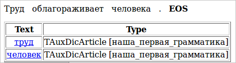
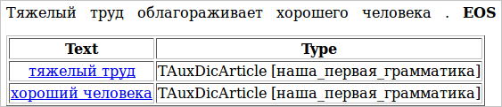

# Простейшие правила

Томитные грамматики работают с цепочками. Одна цепочка соответствует одному предложению в тексте. Из цепочки выделяются подцепочки, которые, в свою очередь, интерпретируются в разбитые по полям факты.

Правила грамматики, которые выделяют подцепочки, выглядят так:

`S -> Noun;`

Это правило выделяет из цепочки все существительные. Например, из текста **(1)** оно выделит подцепочки _труд_ и _человек_.

> **(1)**_Труд облагораживает человека_

Обратим внимание, что при выделении цепочек по умолчанию происходит их нормализация, т.е. они приводятся к начальной форме.

В данном правиле `Noun` является терминалом. Терминал может стоять только в правой части правила. В Томите к терминалам относятся названия частей речи (`Noun`, `Verb`, `Adj`) , некоторые символы (`Comma`, `Punct`, `Ampersand`, `PlusSign`), а также леммы (`‘лес’`, `‘бежать’`) (см. [список терминалов](../dg/terminals-list.md)).

`S` — это нетерминал, который строится из терминалов и должен хотя бы один раз встретиться в левой части правила. Если нетерминал встречается только в левой части и никогда — в правой, значит, это вершина грамматики. Ее также можно указать явно:

```no-highlight
#GRAMMAR_ROOT S    // При помощи директивы #GRAMMAR_ROOT указывается вершина грамматики – нетерминал S
S -> Noun;
```

Также в начале можно указать кодировку, в которой написана грамматика:

```no-highlight
#encoding "utf-8"    // сообщаем парсеру о том, в какой кодировке написана грамматика
#GRAMMAR_ROOT S      // указываем корневой нетерминал грамматики
S -> Noun;           // правило, выделяющее цепочку, состоящую из одного существительного
```

Чтобы запустить грамматику, нам надо создать корневой словарь. Каждую новую грамматику, которую мы будем создавать, нужно будет добавлять туда отдельной статьей. Создадим файл first.cxx, где мы будем писать нашу первую грамматику. Пока там будет только 3 строчки, приведенные выше.

Далее создадим файл mydic.gzt — корневой словарь, и запишем в него следующее:

```no-highlight
encoding "utf8";               // указываем кодировку, в которой написан этот файл
import "base.proto";           // подключаем описания protobuf-типов (TAuxDicArticle и прочих)
import "articles_base.proto";  // Файлы base.proto и articles_base.proto встроены в компилятор.
                               // Их необходимо включать в начало любого gzt-словаря.
// статья с нашей грамматикой:
TAuxDicArticle "наша_первая_грамматика"
{
    key = { "tomita:first.cxx" type=CUSTOM }
}
```

Подробнее о файлах с раширением `.gzt` будет сказано ниже.

Далее надо создать файл с параметрами, где мы укажем путь к корневому словарю, путь к входному и выходному файлу и другую информацию, необходимую для запуска грамматики. Создадим файл `config.proto` и запишем туда следующее:

```no-highlight
encoding "utf8"; // указываем кодировку, в которой написан конфигурационный файл
TTextMinerConfig {
  Dictionary = "mydic.gzt"; // путь к корневому словарю
  PrettyOutput = "PrettyOutput.html"; // путь к файлу с отладочным выводом в удобном для чтения виде
  Input = {
    File = "test.txt"; // путь к входному файлу
  }
  Articles = [
    { Name = "наша_первая_грамматика" } // название статьи в корневом словаре,
                                          // которая содержит запускаемую грамматику
  ]
}
```

Нам осталось только создать файл `test` и записать туда предложения, которые мы хотим обработать нашей грамматикой:

_Труд облагораживает человека._

Для запуска грамматики нам понадобится программа tomitaparser, параметром которой будет файл `config.proto`. Итак, в командной строке нам надо написать такую команду:

```no-highlight
В Linux, FreeBSD и прочих *nix системах:
./tomitaparser config.proto
В Windows:
tomitaparser.exe config.proto
```

На экране появятся сообщения о начале и завершении работы парсера с указанием даты и времени. После завершения работы печатается пустой XML файл, в котором могли бы быть факты, если бы грамматика их выделяла (подробно о фактах написано в последующих разделах учебника).

```no-highlight
[15:10:12 18:20:01] - Start.  (Processing files.)
[15:10:12 18:20:01] - End.  (Processing files.)
<?xml version='1.0' encoding='utf-8'?><fdo_objects></fdo_objects>
```

После этого можно открыть файл `PrettyOutput.html` и посмотреть, какие цепочки выделила наша грамматика. В нашем примере `PrettyOutput.html` будет выглядеть так:



Чтобы извлекать из текста не только отдельные существительные, но и, например, именные группы, применяется операция конкатенации. В качестве оператора конкатенации выступает обычный пробел:

`S -> Adj Noun;`

> **(2)** Тяжелый труд облагораживает человека.

> **(3)**_Тяжелый труд облагораживает хорошего человека._

Теперь мы можем извлечь из текста **(2)** цепочку _тяжелый труд_. Заметим, что человека мы в данном случае проигнорировали: наличие прилагательного перед существительным является обязательным условием выделения цепочки. Исправим ситуацию, немного подкорректировав исходное предложение **(3)**. Теперь на выходе у нас две цепочки: _тяжелый труд_ и _хороший человек_.



А если нас не интересует, какой бывает труд, а интересует только, какие бывают люди, можно написать такую грамматику:

`S -> Adj ‘человек’;`

## Исходные файлы проекта tutorial1

* `tutorial1/config.proto` — конфигурационный файл парсера.
* `tutorial1/mydic.gzt` — корневой словарь.
* `tutorial1/first.cxx` — грамматика.
* `tutorial1/test.txt` — текст.


