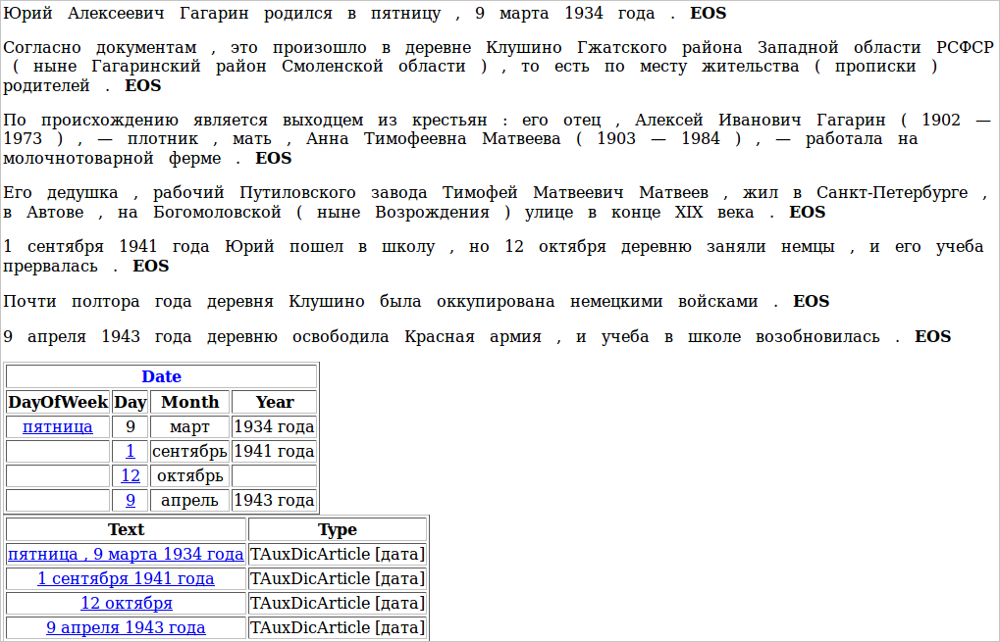

# Интерпретация

В начале мы сказали, что Томита выделяет подцепочки и интерпретирует их в разбитые по полям факты. До этого мы учились только выделять подцепочки, а теперь попробуем преобразовывать их факты.

Пусть у нас есть биография, и мы хотим извлечь из нее все даты. Для дальнейшей обработки даты удобнее извлекать не единой цепочкой, а сразу разбивать по полям: день недели, день, месяц, год. Для этого нам нужно создать факт «Дата» с перечисленными полями. Для описания фактов создаем отдельный файл — facttypes.proto. Его надо импортировать в корневой словарь — добавляем в файл mydic.gzt такую строчку:

`import "facttypes.proto";`

В сам файл facttypes.proto запишем следующее:

```no-highlight
import "base.proto";           // описание protobuf-типов
import "facttypes_base.proto"; // описание protobuf-типа NFactType.TFact
message Date: NFactType.TFact 
{
    optional string DayOfWeek = 1;
    optional string Day = 2;
    optional string Month = 3;
    optional string Year = 4;
}
```

В строке `message Date: NFactType.TFact``Date` является названием типа факта, который мы описываем. Тип факта `Date` наследуется от базового типа `NFactType.TFact`, от которого нужно наследовать все типы фактов. Далее в фигурных скобках описываются поля факта `Date`. Вначале указывается, обязательно ли поле должно быть заполнено (`optional` - может быть пустым, `required` - обязательно должно содержать значение, иначе факт не будет сформирован). Далее указан тип поля `string` - это самый общий тип. В поля типа `string` можно положить любые строки текста.

`DayOfWeek` — название поля. Все поля нумеруются по порядку, начиная с единицы.

Также нам понадобится список дней недели и месяцев — для этого нужно создать соответствующие статьи в газеттире. Чтобы не создавать отдельный файл, их можно добавить прямо в корневой словарь:

```no-highlight
TAuxDicArticle "месяц"
{
    key = "январь" | "февраль" | "март" | "апрель" | "май" | "июнь" |
          "июль" | "август" |   "сентябрь" | "октябрь" | "ноябрь" | "декабрь"
}
TAuxDicArticle "день_недели"
{
    key = "понедельник" | "вторник" | "среда" | "четверг" | "пятница" | "суббота" | "воскресенье"
}
```

Теперь напишем саму грамматику, выделяющую в тексте даты и интерпретирующую их в факты. Назовем ее date.cxx.

```no-highlight
#encoding "utf-8"
DayOfWeek -> Noun<kwtype="день_недели">;      // используем слова из статьи "день_недели"
Day -> AnyWord<wff=/([1-2]?[0-9])|(3[0-1])/>; // число от 1 до 31
Month -> Noun<kwtype="месяц">;                // используем слова из статьи "месяц"
YearDescr -> "год" | "г. ";
Year -> AnyWord<wff=/[1-2]?[0-9]{1,3}г?\.?/>; // число от 0 до 2999 с возможным "г" или "г." в конце
Year -> Year YearDescr;
        // день недели, запятая, число, месяц и год:
        // "понедельник, 3 сентября 2012г."
Date -> DayOfWeek interp (Date.DayOfWeek) (Comma)
        Day interp (Date.Day) 
        Month interp (Date.Month)
        (Year interp (Date.Year)); 
        // число, месяц и год: "10 января 2011"
Date -> Day interp (Date.Day)
        Month interp (Date.Month)
        (Year interp (Date.Year));
        // месяц и год: "июнь 2009"
Date -> Month interp (Date.Month)
        Year interp (Date.Year);
```

Чтобы интерпретировать желаемую подцепочку в факт, надо написать слово interp и после него в скобках указать имя факта и имя поля внутри этого факта, в которое должна попасть подцепочка.

Чтобы запустить эту грамматику, нам надо во-первых, добавить в корневой словарь новую статью:

```no-highlight
TAuxDicArticle "дата"
{
    key = { "tomita:date.cxx" type=CUSTOM }
}
```

Во-вторых, в файл config.proto, содержащий параметры запуска, надо добавить информацию о том, какие факты мы будем использовать в запускаемых грамматиках:

```no-highlight
Facts = [
    { Name = "Date" }
]
```

Также можно добавить выходной файл, куда будут записываться факты (если этого не сделать, то они будут печататься прямо на экран):

```no-highlight
Output = {
    File = "facts.txt";
    Format = text;        // можно использовать следующие форматы:
                          // proto (Google Protobuf), xml, text
}
```

Факты будут сохранены в файл facts.txt (для последующей обработки программами), а также появятся в PrettyOutput.html в удобном для просмотра виде. Например, если мы дадим на вход грамматике отрывок биографии Гагарина:

> **(12)** Юрий Алексеевич Гагарин родился в пятницу, 9 марта 1934 года. Согласно документам, это произошло в деревне Клушино Гжатского района Западной области РСФСР (ныне Гагаринский район Смоленской области), то есть по месту жительства (прописки) родителей. По происхождению является выходцем из крестьян: его отец, Алексей Иванович Гагарин (1902—1973), — плотник, мать, Анна Тимофеевна Матвеева (1903—1984), — работала на молочнотоварной ферме. Его дедушка, рабочий Путиловского завода Тимофей Матвеевич Матвеев, жил в Санкт-Петербурге, в Автове, на Богомоловской (ныне Возрождения) улице в конце XIX века. 1 сентября 1941 года Юрий пошел в школу, но 12 октября деревню заняли немцы, и его учеба прервалась. Почти полтора года деревня Клушино была оккупирована немецкими войсками. 9 апреля 1943 года деревню освободила Красная армия, и учеба в школе возобновилась.

В PrettyOutput.html мы увидим следующее:




## Исходные файлы проекта tutorial4 <a name="isxodnyefajjlyproektatutorial4"></a>

* `tutorial4/config.proto` — конфигурационный файл парсера.
* `tutorial4/facttypes.proto` — описание типов фактов.
* `tutorial4/mydic.gzt` — корневой словарь.
* `tutorial4/date.cxx` — грамматика для дат.
* `tutorial4/test.txt` — текст <q>Юрий Алексеевич Гагарин родился в пятницу ...</q>.


