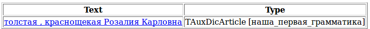

# Ограничения-поля

Какие бывают женщины? Чтобы ответить на этот непростой вопрос, нам необходимо добавить к нашим правилам немного морфологической информации, а именно, указать, что нас интересуют не все имена собственные, а только женские. В Томите для этого используются ограничения-поля. В отличие от ограничений-помет (`h-reg1`, `fw`, `rt` и т.д.), поля могут иметь разные значения, которые задаются как `имя_поля = ‘значение’`. В нашем случае нам нужно поле `gram`, которому приписано значение «женский род».

Немного измененная грамматика для извлечения информации о женщинах будет выглядеть так:

```no-highlight
#encoding "utf-8"
ProperName ->  Word<h-reg1, gram='жен'>+; 
Person -> ProperName | 'женщина'; 
FormOfAddress -> 'товарищ' | 'мисс' | 'миссис' | 'госпожа';
AdjCoord -> Adj;
AdjCoord -> AdjCoord<gnc-agr[1]> ',' Adj<gnc-agr[1]>;
AdjCoord -> AdjCoord<gnc-agr[1]> 'и' Adj<gnc-agr[1]>; 
S -> Adj<gnc-agr[1]>+ (FormOfAddress) Person<gnc-agr[1], rt>; 
S -> AdjCoord<gnc-agr[1]> (FormOfAddress) Person<gnc-agr[1], rt>;
```

Такая грамматика сработает только на последнем из примеров **(6)**-**(8)**.



В качестве значения поля `gram` может выступать любая граммема, приписанная данному слову в морфологическом словаре. Например, чтобы увеличить точность выделения имен собственных, можно указать, что они могут состоять из фамилии, имени и отчества, а не просто из слов, написанных подряд с большой буквы:

```no-highlight
ProperName -> (Word<h-reg1, gram=”фам, жен”>)
              Word<h-reg1, gram=”имя, жен”>
              (Word<h-reg1, gram=”отч, жен”>);
```

