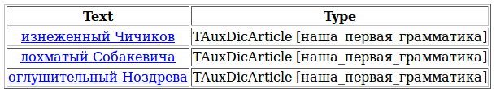

# Ограничения-пометы

У всех людей есть имена. Поэтому, чтобы расширить свои знания о том, какие бывают люди, нам необходимо извлекать не только прилагательные, которые идут перед словом «человек», но и прилагательные, определяющие имена собственные.

Отличительной особенностью имен собственных является то, что все они пишутся с заглавной буквы. Чтобы сообщить эту информацию Томите, надо наложить соответствующее ограничение в правиле на терминал или нетерминал, обозначающий человека.

Для наложения ограничений на терминал или нетерминал в Томите используются специальные пометы (см. [список помет](../dg/all-labels-list.md)). В нашем случае нам нужна помета `h-reg1`, указывающая на то, что первая буква слова должна стоять в верхнем регистре. Если первая буква будет в нижнем регистре, то правило с такой пометой не сработает. Тогда мы получим такое правило:

`S -> Adj Word<h-reg1>;`

Кроме пометы `h-reg1` есть еще помета `h-reg2`, обозначающая, что все буквы слова должны быть в верхнем регистре (как, например, в слове `МОСКВА`), и помета `h-reg3`, обозначающая так называемый верблюжий регистр (или [CamelCase](http://ru.wikipedia.org/wiki/CamelCase)), в котором первая и, как минимум, еще одна буква в слове стоят в верхнем регистре (как, например, в слове `СитиИнвест`)

Обработав следующий текст при помощи правила `S -> Adj Word<h-reg1>` мы узнаем, с какими именно эпитетами упоминаются в нем литературные персонажи.

> **(4)** В красном фраке и белоснежных панталонах ездит этот изнеженный Чичиков по российским просторам и встречает не людей… а кукол фарфоровых: то парочку Маниловых (щечки розовые, оборочки розовые), то лохматого Собакевича с супругой, то оглушительного Ноздрева в венгерке на голый торс. (Гоголь Н.В., <q>Мертвые души</q>)

В этом примере правила сработали на нужных словах, но результат нормализации нас вряд ли устроит, т.к. к словарной форме приведены только прилагательные (Чичикову повезло только потому, что его фамилия была употреблена в нужной форме). Поскольку мы ничего не сказали о связи между `Adj` и `Word<h-reg1>` кроме того, что они стоят рядом и именно в этом порядке, то парсер не знает о том, что прилагательное изменяется вместе с существительным (`лохматый Собакевич`, `лохматого Собакевича`, `лохматому Собакевичу`, ...). По умолчанию к словарной форме приводится только главное слово в цепочке. Если не указано иного, то главным словом цепочки является первое. О том, как сообщить парсеру о связях между словами, и как указать главное слово в цепочке, читайте в следующих разделах этого учебника.

