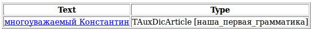
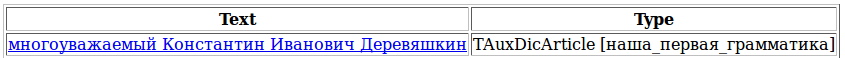
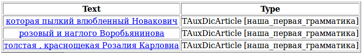
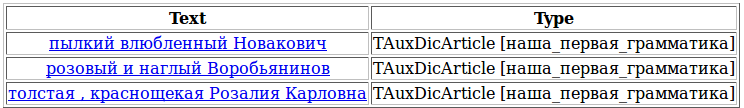

# Операторы

Возьмем другое предложение **(5)** и применим к нему правило `S -> Adj Word<h-reg1>`, обсуждавшееся в [предыдущем разделе](limits-labels.md).

> **(5)** Многоуважаемый Константин Иванович Деревяшкин сначала категорически воспретил ругаться в рупор и даже топнул ногой, но потом, после некоторого колебания, увлеченный этой идеей, велел позвать из соседнего дома бывшего черноморца - отчаянного ругателя и буяна.



Наше правило не выделяет фамилию и отчество Константина. В качестве следующего шага в грамматике необходимо учесть, что после прилагательного может стоять одно, два или сразу три имени (т.е. слова с заглавной буквы). Это можно записать в виде трех отдельных правил.

```no-highlight
S -> Adj Word<h-reg1>;                            // "изнеженный Чичиков"
S -> Adj Word<h-reg1> Word<h-reg1>;               // "новоявленный Аль Капоне"
S -> Adj Word<h-reg1> Word<h-reg1> Word<h-reg1>;  // "многоуважаемый Константин Иванович Деревяшкин"
```

К счастью, эту грамматику можно сократить до одного правила при помощи оператора “+”, обозначающего, что терминал или нетерминал может встретиться в цепочке один или более раз. В результате грамматика будет выглядеть так:

`S -> Adj Word<h-reg1>+;`



Знак <q>+</q> и другие операторы описаны в Руководстве пользователя в разделе [Операторы](../dg/rules.md).

Далее стоит учесть, что прилагательных может быть больше одного, и они могут разделяться запятой или сочинительным союзом или не разделяться ничем:

> **(6)** В центре большого персидского ковра поставили объемистую вазу с крюшоном, а вокруг нее радиусами разлеглась вся компания, не исключая и Яблоньки, которой пылкий влюбленный Новакович смастерил царственное ложе: шкура белого медведя, на шкуре плюшевый плед, а на пледе ― Яблонька, положившая круглый алебастровый подбородок на огромную пушистую голову страшного зверя.

> **(7)** Но прокурор, по-прежнему минуя оружейный магазин, катил каждое утро к зданию судебных установлений, с грустью поглядывая на фигуру Фемиды, державшей весы, в одной чашке которых он явственно видел себя санкт-петербургским прокурором, а в другой ― розового и наглого Воробьянинова.

> **(8)** В спальную вошла толстая, краснощекая Розалия Карловна и остановилась в ожидательной позе.

Для разбора примера под номером 6 нам необходимо добавить к терминалу Adj уже известный нам оператор “+”. Чтобы справиться с примерами 7 и 8 потребуется дописать несколько дополнительных правил:

```no-highlight
AdjCoord -> Adj;                                      // вырожденный случай, когда цепочка пригалательных - однородных членов
                                                      // состоит из одного прилагательного
AdjCoord -> AdjCoord<gnc-agr[1]> ',' Adj<gnc-agr[1]>; // прилагательные - однородные члены могут быть записаны через запятую
AdjCoord -> AdjCoord<gnc-agr[1]> 'и' Adj<gnc-agr[1]>; // или через сочинительный союз 'и'
```

Помета `gnc-agr` означает, что отмеченные ею слова должны быть согласованы по роду, числу и падежу. Подробнее об этом будет написано чуть позже в этом руководстве и в справочнике.

Теперь вспомним о том, что человек может обозначаться не только именем собственным, но и непосредственно словом «человек» и добавим его к терминалу, обозначающему имя собственное, с помощью оператора дизъюнкции: “|”.

Наконец, между именем собственным и определяющим его прилагательным нередко появляется форма обращения – товарищ, господин, мистер и т.д. Чтобы указать, что элемент цепочки является факультативным (может быть, а может и нет), его ставят в круглые скобки.

В итоге мы получаем такую грамматику:

```no-highlight
#encoding "utf-8"
#GRAMMAR_ROOT S
ProperName ->  Word<h-reg1>+;                         // задание имени собственного
Person -> ProperName | 'человек';                     // человек может обозначаться именем собственным
                                                      // или словом “человек”
FormOfAddress -> 'товарищ' | 'мистер' | 'господин';   // перечисление возможных форм обращения
AdjCoord -> Adj;                                      // вырожденный случай, когда цепочка пригалательных - однородных членов
                                                      // состоит из одного прилагательного
AdjCoord -> AdjCoord<gnc-agr[1]> ',' Adj<gnc-agr[1]>; // пригалательные - однородные члены могут быть записаны через запятую
AdjCoord -> AdjCoord<gnc-agr[1]> 'и' Adj<gnc-agr[1]>; // или через сочинительный союз 'и'
S -> Adj+ (FormOfAddress) Person;                     // для случаев, когда прилагательные идут друг за другом
S -> AdjCoord (FormOfAddress) Person;                 // для случаев, когда прилагательные разделены запятой
                                                      // или сочинительным союзом
```

Если применить эту грамматику к примерам 6-8, Томита-парсер выделит 3 цепочки:



Мы видим, что в первую цепочку попало лишнее слово – <q>которой</q>. Это произошло потому, что оно является местоимением-прилагательным, а значит, удовлетворяет правилу `S -> Adj+ (FormOfAddress) Person`;

Вторая цепочка выделилась правильно, но неправильно нормализовалась. Это объясняется тем, что нормализации подвергается только главное слово в цепочке (по умолчанию – первое) и связанные с ним слова, а в наших правилах явным образом не указана связь слов друг с другом.

Обе эти проблемы можно решить, указав в правилах, что существительное и определяющее его прилагательное должны быть согласованы по роду, числу и падежу.

В синтаксисе Томита-парсера это записывается следующим образом:

`S -> Adj<gnc-agr[1]>+ (FormOfAddress) Person<gnc-agr[1]>;`

`gnc-agr` расшифровывается как GenderNumberCase-Agreement (т.е. согласование по роду, числу и падежу), а в квадратных скобках стоит идентификатор согласования, который указывает, какие элементы правой части правила согласуются между собой.

Обратите внимание, что в одном правиле можно использовать несколько разных согласований с разными идентификаторами. Например, в правиле `S -> Participle<gnc-agr[2]> Adj<gnc-agr[1]> Noun<gnc-agr[1], gram=’тв’> Noun<gnc-agr[2], gram=’им’, rt>;` требуется согласование между первым и четвертым терминалами и между вторым и третьим терминалами. Такое правило будет корректно обрабатывать цепочку . Используемые в этом примере пометы `gram='тв'` и `gram='им'` означают, что слова должны стоять в указанных падежах (творительном и именительном). Подробно об этой помете написано в следующих разделах и в справочнике.

Добавим согласование в нашу грамматику:

```no-highlight
#encoding "utf-8"
ProperName ->  Word<h-reg1>+; 
Person -> ProperName | ‘человек’;
FormOfAddress -> ‘товарищ’ | ‘мистер’ | ‘господин’; 
AdjCoord -> Adj;
AdjCoord -> AdjCoord<gnc-agr[1]> ',' Adj<gnc-agr[1]>;
AdjCoord -> AdjCoord<gnc-agr[1]> 'и' Adj<gnc-agr[1]>;
S -> Adj<gnc-agr[1]>+ (FormOfAddress) Person<gnc-agr[1]>; 
S -> AdjCoord<gnc-agr[1]> (FormOfAddress) Person<gnc-agr[1]>;
```



В результате работы этой грамматики, в первом примере извлечется цепочка пылкий влюбленный Новакович без слова которая, т.к. которая не согласуется по роду с Новакович, а во втором нормализуется вся выделенная цепочка, а не только главное слово, т.к. слова явным образом связаны друг с другом через согласование.

